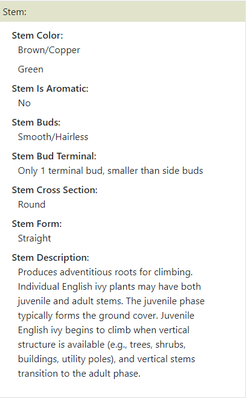

```{r setup, include=FALSE}

knitr::opts_chunk$set(echo=FALSE,
                      message=FALSE,
                      warning=FALSE)

library(papaja)
library(rsconnect)
library(packrat)
library(latex2exp)
library(tinytex)

papaja::r_refs(file="cnipm.bib")

options(knitr.kable.NA="")

```

\newpage

# *Aegopodium podagraria*

## Common names; Bishop's goutweed, Bishops' weed, Gout weed, Ground elder, Herb gerard, Snow on the mountain

```{r aepo}
#| fig.cap = "Aegopodium podagraria leaves photo and leaf description",
#| out.width = "45%",
#| fig.align = "center",
#| fig.show="hold"

knitr::include_graphics("aepo.PNG")

knitr::include_graphics("aepoleav.PNG")

```

Further reading; [@aepo]

\newpage


# *Celastrus orbiculatus*

## Common names; Asian bittersweet, Chinese bittersweet, Oriental bittersweet

```{r ceor}
#| fig.cap = "Celastrus orbiculatus leaves photo and leaf description",
#| out.width = "45%",
#| fig.align = "center",
#| fig.show="hold"

knitr::include_graphics("ceor.PNG")

knitr::include_graphics("ceorleav.PNG")

```

Further reading; [@ceor]

\newpage

# *Hedera helix*

## Common names; Algerian ivy, Baltic ivy, Branching ivy, California ivy, Common ivy, English ivy, Glacier ivy, Needlepoint ivy, Sweetheart ivy

```{r hehe}
#| fig.cap = "Hedera helix leaf description, and stem description.",
#| out.width = "45%",
#| fig.align = "center",
#| fig.show="hold"


knitr::include_graphics("heheleav.PNG")



```

\newpage

## *Hedera Helix* continued...

```{r hehe2}
#| fig.cap = "Hedera helix leaves photo, and poisonous characteristics.",
#| out.width = "45%",
#| fig.align = "center",
#| fig.show="hold"
#| 
knitr::include_graphics("hehe.PNG")

knitr::include_graphics("hehepois.PNG")

```

Further reading; [@hehe]

\newpage

# *Ligustrum japonicum*

## Common names; Amur, Common privet, Curlyleaf ligustrum, Japanese privet, Wax-leaf privet

```{r lija}
#| fig.cap = "Ligustrum japonica leaves photo and poisonous characteristics.",
#| out.width = "45%",
#| fig.align = "center",
#| fig.show="hold"

knitr::include_graphics("lija.PNG")

knitr::include_graphics("lijapois.PNG")

```

\newpage

## *Ligustrum japonicum* continued...

```{r lija2}
#| fig.cap = "Ligustrum japonica leaf description and stem description.",
#| out.width = "45%",
#| fig.align = "center",
#| fig.show="hold"

knitr::include_graphics("lijaleav.PNG")

knitr::include_graphics("lijastem.PNG")

```

Further reading; [@lija]

\newpage

# *Pueraria montana* and *Pueraria montana var. lobata*

## Common names; Kudzu, Japanese arrowroot, Kudzu bean, Kudzu hemp, Kudzu vine

```{r pumo}
#| fig.cap = "Pueraria montana leaves photo and edibility description of Kudzu.",
#| out.width="45%",
#| fig.align="center",
#| fig.show="hold"

knitr::include_graphics("pumo.PNG")

knitr::include_graphics("pumoedib.PNG")

```

\newpage

## *Pueraria montana* and *Pueraria montana var. lobata* continued...

```{r pumo2}
#| fig.cap="Pueraria montana leaf description, and Pueraria montana var. lobata leaf and stem descriptions.",
#| out.width="45%",
#| fig.align="center",
#| fig.show="hold"

knitr::include_graphics("pumoleav.PNG")

knitr::include_graphics("pumolo.PNG")

```


Further reading; [@pumo]

\newpage

# *Reynoutria japonica*

## Common names; Asiatic knotweed, Donkey rhubarb, Fleeceflower, Huzhang, Japanese bamboo, Japanese knotweed, Mexican bamboo

```{r reja}
#| fig.cap = "Reynoutria japonica leaves photo.",
#| out.width = "30%",
#| fig.align = "center",
#| fig.show="hold"

knitr::include_graphics("reja.PNG")

```

\newpage

## *Reynoutria japonica* continued...

```{r reja2}
#| fig.cap = "Reynoutria japonica leaf description and stem description.",
#| out.width = "30%",
#| fig.align = "center",
#| fig.show="hold"

knitr::include_graphics("rejaleav.PNG")

knitr::include_graphics("rejastem.PNG")


```

Further reading; [@reja]

\newpage

# *Rosa multiflora*

## Common names; Multiflora rose

```{r romu}
#| fig.cap = "Rosa multiflora stipules photo.",
#| out.width = "75%",
#| fig.align = "center",
#| fig.show="hold"

knitr::include_graphics("romu.PNG")

```

\newpage

## *Rosa multiflora* continued...

```{r romu2}
#| fig.cap = "Rosa multiflora leaf description, and stem description.",
#| out.width = "45%",
#| fig.align = "center",
#| fig.show="hold"

knitr::include_graphics("romuleav.PNG")

knitr::include_graphics("romustem.PNG")


```

Further reading; [@romu]

\newpage

# References


