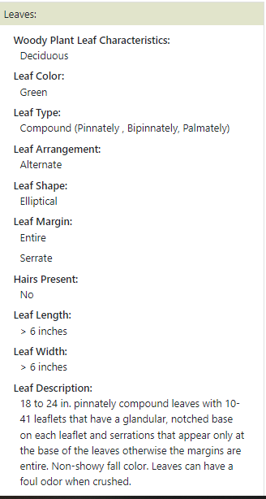

```{r setup, include=FALSE}

knitr::opts_chunk$set(echo=FALSE,
                      message=FALSE,
                      warning=FALSE)

library(papaja)
library(rsconnect)
library(packrat)
library(latex2exp)
library(tinytex)

papaja::r_refs(file="cnipm.bib")

options(knitr.kable.NA="")

```

\newpage

# *Aegopodium podagraria*

## Common names; Bishop's goutweed, Bishops' weed, Gout weed, Ground elder, Herb gerard, Snow on the mountain

```{r aepo}
#| fig.cap = "Aegopodium podagraria leaves photo.",
#| out.width = "100%",
#| fig.align = "center"

knitr::include_graphics("photos/aepo.PNG")

```

\newpage

## *Aegopodium podagraria* continued...

```{r aepo2}
#| fig.cap = "Aegopodium podagraria leaf description.",
#| out.width = "55%",
#| fig.align = "center"


```

Further reading; [@aepo]

\newpage


# *Ailanthus altissima*

## Common names; Ailanthus, Chinese sumac, Copal tree, Deerwort, Hardy age, Milk ipecac, Mist flower, Paradise-tree, Rich weed, Stinking sumac, Tree of Heaven, Varnish tree, White sanicle, White snakeroot

```{r aial}
#| fig.cap = "Ailanthus altissima leaves photo.",
#| out.width = "100%",
#| fig.align = "center"

knitr::include_graphics("photos/aial.PNG")

```

\newpage

## *Ailanthus altissima* continued...

```{r aial2}
#| fig.cap = "Ailanthus altissima leaf description.",
#| out.width = "55%",
#| fig.align = "center"



```

\newpage

## *Ailanthus altissima* continued...

```{r aial3}
#| fig.cap = "Ailanthus altissima bark and stem descriptions.",
#| out.width = "55%",
#| fig.align = "center"


```

Further reading; [@aial]

\newpage


# *Akebia quinata*

## Common names; Tree of Heaven

```{r akqu}
#| fig.cap = "Akebia quinata leaves photo.",
#| out.width = "100%",
#| fig.align = "center"

knitr::include_graphics("photos/akqu.PNG")

```

\newpage

## *Akebia quinata* continued...

```{r akqu2}
#| fig.cap = "Akebia quinata leaf description.",
#| out.width = "55%",
#| fig.align = "center"


```

\newpage

## *Akebia quinata* continued...

```{r akqu3}
#| fig.cap = "Akebia quinata stem description.",
#| out.width = "55%",
#| fig.align = "center"


```

Further reading; [@akqu]

\newpage

# *Albizia julibrissin*

## Common names; Mimosa, Persian silk tree, Pink silk tree, Silk tree

```{r alju}
#| fig.cap = "Albizia julibrissin leaves photo.",
#| out.width = "100%",
#| fig.align = "center"

knitr::include_graphics("photos/alju.PNG")

```

\newpage

## *Albizia julibrissin* continued...

```{r alju2}
#| fig.cap = "Albizia julibrissin leaf description.",
#| out.width = "55%",
#| fig.align = "center"


```

\newpage

## *Albizia julibrissin* continued...

```{r alju3}
#| fig.cap = "Albizia julibrissin leaf description continued.",
#| out.width = "55%",
#| fig.align = "center"

knitr::include_graphics("photos/aljuleav2.PNG")

```

\newpage

## *Albizia julibrissin* continued...

```{r alju4}
#| fig.cap = "Albizia julibrissin stem description.",
#| out.width = "55%",
#| fig.align = "center"


```

\newpage

## *Albizia julibrissin* continued...

```{r alju5}
#| fig.cap = "Albizia julibrissin bark description.",
#| out.width = "55%",
#| fig.align = "center"


```

Further reading; [@alju]

\newpage

# *Alliaria petiolata*

## Common names; Garlic Mustard, Garlicwort, Hedge garlic, Jack-in-the-bush, Mustard root, Poor man's mustard, Sauce-alone

```{r alpe}
#| fig.cap = "Alliaria petiolata leaves photo.",
#| out.width = "100%",
#| fig.align = "center"

knitr::include_graphics("photos/alpe.PNG")

```

\newpage

## *Alliaria petiolata* continued...

```{r alpe2}
#| fig.cap = "Alliaria petiolata leaf description.",
#| out.width = "55%",
#| fig.align = "center"


```

\newpage

## *Alliaria petiolata* continued...

```{r alpe3}
#| fig.cap = "Alliaria petiolata stem description.",
#| out.width = "55%",
#| fig.align = "center"


```

Further reading; [@alpe]

\newpage

# *Buddleja davidii*

## Common names; Garlic Mustard, Garlicwort, Hedge garlic, Jack-in-the-bush, Mustard root, Poor man's mustard, Sauce-alone

```{r buda}
#| fig.cap = "Buddleja davidii leaves photo.",
#| out.width = "100%",
#| fig.align = "center"

knitr::include_graphics("photos/buda.PNG")

```

\newpage

## *Buddleja davidii* continued...

```{r buda2}
#| fig.cap = "Buddleja davidii leaf description.",
#| out.width = "55%",
#| fig.align = "center"

knitr::include_graphics("photos/budaleav.PNG")

```

\newpage

## *Buddleja davidii* continued...

```{r buda3}
#| fig.cap = "Buddleja davidii stem description.",
#| out.width = "55%",
#| fig.align = "center"

knitr::include_graphics("photos/budastem.PNG")

```

Further reading; [@buda]

\newpage

# *Celastrus orbiculatus*

## Common names; Asian bittersweet, Chinese bittersweet, Oriental bittersweet

```{r ceor}
#| fig.cap = "Celastrus orbiculatus leaves photo.",
#| out.width = "100%",
#| fig.align = "center"

knitr::include_graphics("photos/ceor.PNG")

```

\newpage

## *Celastrus orbiculatus* continued...

```{r ceor2}
#| fig.cap = "Celastrus orbiculatus leaf description.",
#| out.width = "45%",
#| fig.align = "center"

knitr::include_graphics("photos/ceorleav.PNG")

```

Further reading; [@ceor]

\newpage

# *Clematis terniflora*

## Common names; Garlic Mustard, Garlicwort, Hedge garlic, Jack-in-the-bush, Mustard root, Poor man's mustard, Sauce-alone

```{r alpe}
#| fig.cap = "Alliaria petiolata leaves photo.",
#| out.width = "100%",
#| fig.align = "center"

knitr::include_graphics("photos/alpe.PNG")

```

\newpage

## *Alliaria petiolata* continued...

```{r alpe2}
#| fig.cap = "Alliaria petiolata leaf description.",
#| out.width = "55%",
#| fig.align = "center"


```

\newpage

## *Alliaria petiolata* continued...

```{r alpe3}
#| fig.cap = "Alliaria petiolata stem description.",
#| out.width = "55%",
#| fig.align = "center"


```

Further reading; [@alpe]

\newpage

# *Dioscorea bulbifera*

## Common names; Garlic Mustard, Garlicwort, Hedge garlic, Jack-in-the-bush, Mustard root, Poor man's mustard, Sauce-alone

```{r alpe}
#| fig.cap = "Alliaria petiolata leaves photo.",
#| out.width = "100%",
#| fig.align = "center"

knitr::include_graphics("photos/alpe.PNG")

```

\newpage

## *Alliaria petiolata* continued...

```{r alpe2}
#| fig.cap = "Alliaria petiolata leaf description.",
#| out.width = "55%",
#| fig.align = "center"


```

\newpage

## *Alliaria petiolata* continued...

```{r alpe3}
#| fig.cap = "Alliaria petiolata stem description.",
#| out.width = "55%",
#| fig.align = "center"


```

Further reading; [@alpe]

\newpage

# *Elaeagnus umbellata*

## Common names; Garlic Mustard, Garlicwort, Hedge garlic, Jack-in-the-bush, Mustard root, Poor man's mustard, Sauce-alone

```{r alpe}
#| fig.cap = "Alliaria petiolata leaves photo.",
#| out.width = "100%",
#| fig.align = "center"

knitr::include_graphics("photos/alpe.PNG")

```

\newpage

## *Alliaria petiolata* continued...

```{r alpe2}
#| fig.cap = "Alliaria petiolata leaf description.",
#| out.width = "55%",
#| fig.align = "center"


```

\newpage

## *Alliaria petiolata* continued...

```{r alpe3}
#| fig.cap = "Alliaria petiolata stem description.",
#| out.width = "55%",
#| fig.align = "center"


```

Further reading; [@alpe]

\newpage

# *Enonymus alatus*

## Common names; Garlic Mustard, Garlicwort, Hedge garlic, Jack-in-the-bush, Mustard root, Poor man's mustard, Sauce-alone

```{r alpe}
#| fig.cap = "Alliaria petiolata leaves photo.",
#| out.width = "100%",
#| fig.align = "center"

knitr::include_graphics("photos/alpe.PNG")

```

\newpage

## *Alliaria petiolata* continued...

```{r alpe2}
#| fig.cap = "Alliaria petiolata leaf description.",
#| out.width = "55%",
#| fig.align = "center"


```

\newpage

## *Alliaria petiolata* continued...

```{r alpe3}
#| fig.cap = "Alliaria petiolata stem description.",
#| out.width = "55%",
#| fig.align = "center"


```

Further reading; [@alpe]

\newpage

# *Euonymus fortunei*

## Common names; Garlic Mustard, Garlicwort, Hedge garlic, Jack-in-the-bush, Mustard root, Poor man's mustard, Sauce-alone

```{r alpe}
#| fig.cap = "Alliaria petiolata leaves photo.",
#| out.width = "100%",
#| fig.align = "center"

knitr::include_graphics("photos/alpe.PNG")

```

\newpage

## *Alliaria petiolata* continued...

```{r alpe2}
#| fig.cap = "Alliaria petiolata leaf description.",
#| out.width = "55%",
#| fig.align = "center"


```

\newpage

## *Alliaria petiolata* continued...

```{r alpe3}
#| fig.cap = "Alliaria petiolata stem description.",
#| out.width = "55%",
#| fig.align = "center"


```

Further reading; [@alpe]

\newpage

# *Glechoma hederacea*

## Common names; Garlic Mustard, Garlicwort, Hedge garlic, Jack-in-the-bush, Mustard root, Poor man's mustard, Sauce-alone

```{r alpe}
#| fig.cap = "Alliaria petiolata leaves photo.",
#| out.width = "100%",
#| fig.align = "center"

knitr::include_graphics("photos/alpe.PNG")

```

\newpage

## *Alliaria petiolata* continued...

```{r alpe2}
#| fig.cap = "Alliaria petiolata leaf description.",
#| out.width = "55%",
#| fig.align = "center"


```

\newpage

## *Alliaria petiolata* continued...

```{r alpe3}
#| fig.cap = "Alliaria petiolata stem description.",
#| out.width = "55%",
#| fig.align = "center"


```

Further reading; [@alpe]

\newpage

# *Hedera helix*

## Common names; Algerian ivy, Baltic ivy, Branching ivy, California ivy, Common ivy, English ivy, Glacier ivy, Needlepoint ivy, Sweetheart ivy

```{r hehe}
#| fig.cap = "Hedera helix leaves photo.",
#| out.width = "65%",
#| fig.align = "center"

knitr::include_graphics("photos/hehe.PNG")

```

\newpage

## *Hedera Helix* continued...

```{r hehe2}
#| fig.cap = "Hedera helix leaf description.",
#| out.width = "45%",
#| fig.align = "center",
#| fig.show="hold"


knitr::include_graphics("photos/heheleav.PNG")

```

\newpage

## *Hedera Helix* continued...

```{r hehe3}
#| fig.cap = "Hedera helix poisonous characteristics.",
#| out.width = "50%",
#| fig.align = "center"

knitr::include_graphics("photos/hehepois.PNG")

```

Further reading; [@hehe]

\newpage

# *Iris pseudacorus*

## Common names; Garlic Mustard, Garlicwort, Hedge garlic, Jack-in-the-bush, Mustard root, Poor man's mustard, Sauce-alone

```{r alpe}
#| fig.cap = "Alliaria petiolata leaves photo.",
#| out.width = "100%",
#| fig.align = "center"

knitr::include_graphics("photos/alpe.PNG")

```

\newpage

## *Alliaria petiolata* continued...

```{r alpe2}
#| fig.cap = "Alliaria petiolata leaf description.",
#| out.width = "55%",
#| fig.align = "center"


```

\newpage

## *Alliaria petiolata* continued...

```{r alpe3}
#| fig.cap = "Alliaria petiolata stem description.",
#| out.width = "55%",
#| fig.align = "center"


```

Further reading; [@alpe]

\newpage

# *Ligustrum japonicum*

## Common names; Amur, Common privet, Curlyleaf ligustrum, Japanese privet, Wax-leaf privet

```{r lija}
#| fig.cap = "Ligustrum japonica leaves photo.",
#| out.width = "100%",
#| fig.align = "center"


```

\newpage

## *Ligustrum japonicum* continued...

```{r lija2}
#| fig.cap = "Ligustrum japonica poisonous characteristics.",
#| out.width = "80%",
#| fig.align = "center"

knitr::include_graphics("photos/lijapois.PNG")

```

\newpage

## *Ligustrum japonicum* continued...

```{r lija3}
#| fig.cap = "Ligustrum japonica leaf description.",
#| out.width = "55%",
#| fig.align = "center"

knitr::include_graphics("photos/lijaleav.PNG")

```

\newpage

## *Ligustrum japonicum* continued...

```{r lija4}
#| fig.cap = "Ligustrum japonica stem description.",
#| out.width = "75%",
#| fig.align = "center"

knitr::include_graphics("photos/lijastem.PNG")

```

Further reading; [@lija]

\newpage

# *Lonicera japonica*

## Common names; Garlic Mustard, Garlicwort, Hedge garlic, Jack-in-the-bush, Mustard root, Poor man's mustard, Sauce-alone

```{r alpe}
#| fig.cap = "Alliaria petiolata leaves photo.",
#| out.width = "100%",
#| fig.align = "center"

knitr::include_graphics("photos/alpe.PNG")

```

\newpage

## *Alliaria petiolata* continued...

```{r alpe2}
#| fig.cap = "Alliaria petiolata leaf description.",
#| out.width = "55%",
#| fig.align = "center"


```

\newpage

## *Alliaria petiolata* continued...

```{r alpe3}
#| fig.cap = "Alliaria petiolata stem description.",
#| out.width = "55%",
#| fig.align = "center"


```

Further reading; [@alpe]

\newpage

# *Lunaria annua*

## Common names; Garlic Mustard, Garlicwort, Hedge garlic, Jack-in-the-bush, Mustard root, Poor man's mustard, Sauce-alone

```{r alpe}
#| fig.cap = "Alliaria petiolata leaves photo.",
#| out.width = "100%",
#| fig.align = "center"

knitr::include_graphics("photos/alpe.PNG")

```

\newpage

## *Alliaria petiolata* continued...

```{r alpe2}
#| fig.cap = "Alliaria petiolata leaf description.",
#| out.width = "55%",
#| fig.align = "center"


```

\newpage

## *Alliaria petiolata* continued...

```{r alpe3}
#| fig.cap = "Alliaria petiolata stem description.",
#| out.width = "55%",
#| fig.align = "center"


```

Further reading; [@alpe]

\newpage

# *Microstegium vimineum*

## Common names; Garlic Mustard, Garlicwort, Hedge garlic, Jack-in-the-bush, Mustard root, Poor man's mustard, Sauce-alone

```{r alpe}
#| fig.cap = "Alliaria petiolata leaves photo.",
#| out.width = "100%",
#| fig.align = "center"

knitr::include_graphics("photos/alpe.PNG")

```

\newpage

## *Alliaria petiolata* continued...

```{r alpe2}
#| fig.cap = "Alliaria petiolata leaf description.",
#| out.width = "55%",
#| fig.align = "center"


```

\newpage

## *Alliaria petiolata* continued...

```{r alpe3}
#| fig.cap = "Alliaria petiolata stem description.",
#| out.width = "55%",
#| fig.align = "center"


```

Further reading; [@alpe]

\newpage

# *Miscanthus sinese*

## Common names; Garlic Mustard, Garlicwort, Hedge garlic, Jack-in-the-bush, Mustard root, Poor man's mustard, Sauce-alone

```{r alpe}
#| fig.cap = "Alliaria petiolata leaves photo.",
#| out.width = "100%",
#| fig.align = "center"

knitr::include_graphics("photos/alpe.PNG")

```

\newpage

## *Alliaria petiolata* continued...

```{r alpe2}
#| fig.cap = "Alliaria petiolata leaf description.",
#| out.width = "55%",
#| fig.align = "center"


```

\newpage

## *Alliaria petiolata* continued...

```{r alpe3}
#| fig.cap = "Alliaria petiolata stem description.",
#| out.width = "55%",
#| fig.align = "center"


```

Further reading; [@alpe]

\newpage

# *Myriophyllum aquaticum*

## Common names; Garlic Mustard, Garlicwort, Hedge garlic, Jack-in-the-bush, Mustard root, Poor man's mustard, Sauce-alone

```{r alpe}
#| fig.cap = "Alliaria petiolata leaves photo.",
#| out.width = "100%",
#| fig.align = "center"

knitr::include_graphics("photos/alpe.PNG")

```

\newpage

## *Alliaria petiolata* continued...

```{r alpe2}
#| fig.cap = "Alliaria petiolata leaf description.",
#| out.width = "55%",
#| fig.align = "center"


```

\newpage

## *Alliaria petiolata* continued...

```{r alpe3}
#| fig.cap = "Alliaria petiolata stem description.",
#| out.width = "55%",
#| fig.align = "center"


```

Further reading; [@alpe]

\newpage

# *Nandina domestica*

## Common names; Garlic Mustard, Garlicwort, Hedge garlic, Jack-in-the-bush, Mustard root, Poor man's mustard, Sauce-alone

```{r alpe}
#| fig.cap = "Alliaria petiolata leaves photo.",
#| out.width = "100%",
#| fig.align = "center"

knitr::include_graphics("photos/alpe.PNG")

```

\newpage

## *Alliaria petiolata* continued...

```{r alpe2}
#| fig.cap = "Alliaria petiolata leaf description.",
#| out.width = "55%",
#| fig.align = "center"


```

\newpage

## *Alliaria petiolata* continued...

```{r alpe3}
#| fig.cap = "Alliaria petiolata stem description.",
#| out.width = "55%",
#| fig.align = "center"


```

Further reading; [@alpe]

\newpage

# *Paulownia tomentosa*

## Common names; Garlic Mustard, Garlicwort, Hedge garlic, Jack-in-the-bush, Mustard root, Poor man's mustard, Sauce-alone

```{r alpe}
#| fig.cap = "Alliaria petiolata leaves photo.",
#| out.width = "100%",
#| fig.align = "center"

knitr::include_graphics("photos/alpe.PNG")

```

\newpage

## *Alliaria petiolata* continued...

```{r alpe2}
#| fig.cap = "Alliaria petiolata leaf description.",
#| out.width = "55%",
#| fig.align = "center"


```

\newpage

## *Alliaria petiolata* continued...

```{r alpe3}
#| fig.cap = "Alliaria petiolata stem description.",
#| out.width = "55%",
#| fig.align = "center"


```

Further reading; [@alpe]

\newpage

# *Pennisetum alopecuroides*

## Common names; Garlic Mustard, Garlicwort, Hedge garlic, Jack-in-the-bush, Mustard root, Poor man's mustard, Sauce-alone

```{r alpe}
#| fig.cap = "Alliaria petiolata leaves photo.",
#| out.width = "100%",
#| fig.align = "center"

knitr::include_graphics("photos/alpe.PNG")

```

\newpage

## *Alliaria petiolata* continued...

```{r alpe2}
#| fig.cap = "Alliaria petiolata leaf description.",
#| out.width = "55%",
#| fig.align = "center"


```

\newpage

## *Alliaria petiolata* continued...

```{r alpe3}
#| fig.cap = "Alliaria petiolata stem description.",
#| out.width = "55%",
#| fig.align = "center"


```

Further reading; [@alpe]

\newpage

# *Pueraria montana* and *Pueraria montana var. lobata*

## Common names; Kudzu, Japanese arrowroot, Kudzu bean, Kudzu hemp, Kudzu vine

```{r pumo}
#| fig.cap = "Pueraria montana leaves photo.",
#| out.width="75%",
#| fig.align="center"

knitr::include_graphics("photos/pumo.PNG")

```

\newpage

## *Pueraria montana* and *Pueraria montana var. lobata* continued...

```{r pumo2}
#| fig.cap = "Edibility description of Kudzu.",
#| out.width="100%",
#| fig.align="center"

knitr::include_graphics("photos/pumoedib.PNG")

```

\newpage

## *Pueraria montana* and *Pueraria montana var. lobata* continued...

```{r pumo3}
#| fig.cap="Pueraria montana leaf description.",
#| out.width="55%",
#| fig.align="center"


```

\newpage

## *Pueraria montana* and *Pueraria montana var. lobata* continued...

```{r pumo4}
#| fig.cap="Pueraria montana var. lobata leaf and stem descriptions.",
#| out.width="55%",
#| fig.align="center"

knitr::include_graphics("photos/pumolo.PNG")

```


Further reading; [@pumo]

\newpage

# *Pyrus calleryana*

## Common names; Garlic Mustard, Garlicwort, Hedge garlic, Jack-in-the-bush, Mustard root, Poor man's mustard, Sauce-alone

```{r alpe}
#| fig.cap = "Alliaria petiolata leaves photo.",
#| out.width = "100%",
#| fig.align = "center"

knitr::include_graphics("photos/alpe.PNG")

```

\newpage

## *Alliaria petiolata* continued...

```{r alpe2}
#| fig.cap = "Alliaria petiolata leaf description.",
#| out.width = "55%",
#| fig.align = "center"


```

\newpage

## *Alliaria petiolata* continued...

```{r alpe3}
#| fig.cap = "Alliaria petiolata stem description.",
#| out.width = "55%",
#| fig.align = "center"


```

Further reading; [@alpe]

\newpage

# *Reynoutria japonica*

## Common names; Asiatic knotweed, Donkey rhubarb, Fleeceflower, Huzhang, Japanese bamboo, Japanese knotweed, Mexican bamboo

```{r reja}
#| fig.cap = "Reynoutria japonica leaves photo.",
#| out.width = "65%",
#| fig.align = "center"


```

\newpage

## *Reynoutria japonica* continued...

```{r reja2}
#| fig.cap = "Reynoutria japonica leaf description.",
#| out.width = "50%",
#| fig.align = "center"

knitr::include_graphics("photos/rejaleav.PNG")

```

\newpage

## *Reynoutria japonica* continued...

```{r reja3}
#| fig.cap = "Reynoutria japonica stem description.",
#| out.width = "100%",
#| fig.align = "center"


```

Further reading; [@reja]

\newpage

# *Rosa multiflora*

## Common names; Multiflora rose

```{r romu}
#| fig.cap = "Rosa multiflora stipules photo.",
#| out.width = "100%",
#| fig.align = "center"


```

\newpage

## *Rosa multiflora* continued...

```{r romu2}
#| fig.cap = "Rosa multiflora leaf description.",
#| out.width = "60%",
#| fig.align = "center"


```

\newpage

## *Rosa multiflora* continued...

```{r romu3}
#| fig.cap = "Rosa multiflora stem description.",
#| out.width = "100%",
#| fig.align = "center"

knitr::include_graphics("photos/romustem.PNG")


```

Further reading; [@romu]

\newpage

# *Spiraea japonica*

## Common names; Garlic Mustard, Garlicwort, Hedge garlic, Jack-in-the-bush, Mustard root, Poor man's mustard, Sauce-alone

```{r alpe}
#| fig.cap = "Alliaria petiolata leaves photo.",
#| out.width = "100%",
#| fig.align = "center"

knitr::include_graphics("photos/alpe.PNG")

```

\newpage

## *Alliaria petiolata* continued...

```{r alpe2}
#| fig.cap = "Alliaria petiolata leaf description.",
#| out.width = "55%",
#| fig.align = "center"


```

\newpage

## *Alliaria petiolata* continued...

```{r alpe3}
#| fig.cap = "Alliaria petiolata stem description.",
#| out.width = "55%",
#| fig.align = "center"


```

Further reading; [@alpe]

\newpage

# *Vinca major* and *V. minor*

## Common names; Garlic Mustard, Garlicwort, Hedge garlic, Jack-in-the-bush, Mustard root, Poor man's mustard, Sauce-alone

```{r alpe}
#| fig.cap = "Alliaria petiolata leaves photo.",
#| out.width = "100%",
#| fig.align = "center"

knitr::include_graphics("photos/alpe.PNG")

```

\newpage

## *Alliaria petiolata* continued...

```{r alpe2}
#| fig.cap = "Alliaria petiolata leaf description.",
#| out.width = "55%",
#| fig.align = "center"


```

\newpage

## *Alliaria petiolata* continued...

```{r alpe3}
#| fig.cap = "Alliaria petiolata stem description.",
#| out.width = "55%",
#| fig.align = "center"


```

Further reading; [@alpe]

\newpage

# *Wisteria sinensis*

## Common names; Garlic Mustard, Garlicwort, Hedge garlic, Jack-in-the-bush, Mustard root, Poor man's mustard, Sauce-alone

```{r alpe}
#| fig.cap = "Alliaria petiolata leaves photo.",
#| out.width = "100%",
#| fig.align = "center"

knitr::include_graphics("photos/alpe.PNG")

```

\newpage

## *Alliaria petiolata* continued...

```{r alpe2}
#| fig.cap = "Alliaria petiolata leaf description.",
#| out.width = "55%",
#| fig.align = "center"


```

\newpage

## *Alliaria petiolata* continued...

```{r alpe3}
#| fig.cap = "Alliaria petiolata stem description.",
#| out.width = "55%",
#| fig.align = "center"


```

Further reading; [@alpe]

\newpage

# References


